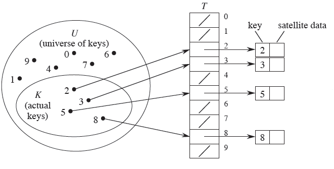
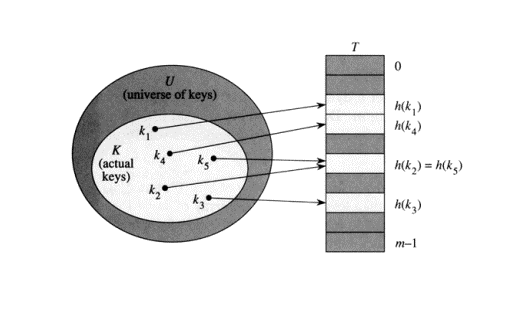

# Hash

[TOC]

## 해시(Hash)의 정의

- 해시 함수(hash function) : 데이터의 효율적 관리를 목적으로 임의의 길이를 가진 데이터를 고정된 길이의 데이터로 매핑하는 함수
  - **키(key)** : 매핑 전 원래 데이터의 값
  - **해시값(hash value)** : 매핑 후 데이터의 값
  - **해싱(hashing)** : 매핑하는 과정 자체
  - 해시 함수에는 일관성이 있어야 한다. 만약 'apple'을 넣었을 때 4를 반환한다면 'apple'을 넣을 때마다 항상 4를 반환해야 한다.
  - 다른 key가 들어가면 다른 value가 나와야 한다. 어떤 key를 넣어도 1만 나온다면 좋은 해시 함수라 볼 수 없다.

### 해시의 용도

- **해시 테이블** : 해시테이블은 데이터의 해시 값을 테이블 내의 주소로 이용하는 탐색 알고리즘 
- **암호화** : 해시는 입력받은 데이터를 완전히 새로운 모습의 데이터로 만든다. 해시를 통해 변환된 데이터는 원본의 모습을 알아볼 수 없을 정도로 완전히 달라진다. 이 특성 때문에 해시는 암호화 영역에서 아주 주요하게 사용되고 있다. SHA(Secure Hash Algorithm)알고리즘이 그 대표적인 예이다.
- **데이터 축약** : 해시는 길이가 서로 다른 입력 데이터에 대해 일정한 길이의 출력을 만들 수 있다. 이 특성을 이용하면 커다란 데이터를 '해시'하면 짧은 길이로 축약할 수 있다. 이렇게 축약된 데이터끼리 비교를 수행하면 커다란 원본 데이터들을 비교하는 것에 비해 엄청난 효율을 거둘 수 있다.

## 테이블의 종류

### Direct Addressing Table

`Direct Addressing Table`은 key-value 쌍의 데이터를 배열에 저장하는데, key 값을 직접적으로 배열의 인덱스로 사용한다.

- 키의 전체 개수와 동일한 크기를 가진다.
- 삽입 : 각각의 key가 보유한 자신의 공간에 값을 저장한다.
- 삭제 : 해당 key의 위치에 NULL 값을 넣어준다.
- 탐색 : 해당 키의 위치를 참조한다.
- 삽입, 삭제, 탐색 모두 시간복잡도가 **O(1)**이다.

key 값의 최대 크기만큼 배열이 할당되기 때문에, 크기가 매우 크면서 저장하고자 하는 데이터가 적다면 공간을 많이 낭비할 수 있다는 단점이 존재한다.

### Hash Table

`해시 테이블(Hash Table)`은 key-value 쌍에서 key 값을 테이블에 저장할 때, `Direct Addressing Table`과는 달리 key 값을 함수를 이용해 계산을 수행한 후 그 결과값을 배열의 인덱스로 사용하여 저장하는 방식이다. 여기서 key 값을 계산하는 함수를 `해시 함수(Hash Function)`이라고 부른다.

- 해시 함수는 입력으로 key 값을 받아, 0부터 배열의 크기 - 1 사이의 값을 출력한다.
  - 이 경우 k 값이 h(k)로 `해시되었다`고 하며, h(k)를 k의 `해시값`이라고 한다.
- 해시 함수는 같은 key에 대해서는 항상 같은 인덱스를 할당한다. key가 다르면 인덱스도 다르다.

`해시 테이블`은 key 값의 크기에 테이블의 크기가 좌우되지 않고, h(k) 만큼의 공간에 저장되기 때문에 공간 낭비가 적다.

## 충돌(Collusion)

충돌이란, 서로 다른 k값이 동일한 h(k) 값을 가져 같은 slot에 저장되는 경우를 일컫는다.

- 현재까지 개발된 거의 모든 해시 함수는 해시 충돌을 일으키는 것으로 확인됐다.
- 해시 충돌이 해시값 전체에 걸쳐 균등하게 발생하게끔 하는 것이 중요하다.

### 충돌을 해결하는 방법

- **Chaining** : 같은 공간에 여러 개의 key를 연결 리스트로 만들어 넣는 방법. 연결 리스트가 길어질수록 해시 테이블의 속도도 느려진다. 
- 충돌을 해결하려면 `낮은 사용률`과 `좋은 해시 함수`가 필요하다.
  - **사용률(load factor)** : 해시 테이블에 있는 항목의 수 / 해시 테이블에 있는 공간의 수
  - **리사이징(resizing)** : 사용률이 큰 해시 테이블에 공간을 추가하는 작업. 기존 해시 테이블보다 더 큰 배열(두 배 정도)을 생성한 뒤 해시 함수를 사용해 모든 항목을 다시 넣는다. 일반적으로 사용률이 0.7보다 커지면 리사이징한다.