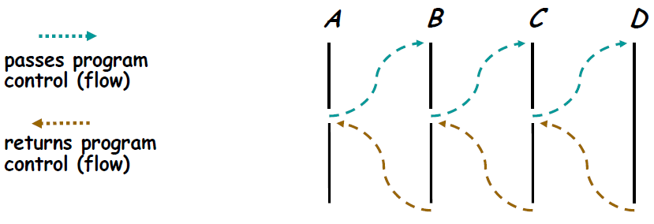

# Stack and Queue

[TOC]

## 스택(Stack)

### 스택(Stack)의 개념
목록 한 쪽 끝에서만 자료를 넣고 뺄 수 있는 `LIFO(Last In First Out)` 형식의 자료 구조


### 스택의 연산

- **푸시(push)** : item 하나를 스택의 가장 윗 부분에 추가한다.

- **팝(pop)** : 스택에서 가장 위에 있는 항목을 제거한다.

- **픽(peek)** : 스택의 가장 위에 있는 항목을 반환한다.

- **isEmpty()**: 스택이 비어 있을 때에 true를 반환한다.

- 푸시, 팝, 픽 모두 **O(1)**의 시간복잡도가 소요된다.


### 스택(Stack)의 구현

스택은 배열 리스트, 연결 리스트 등 다양한 자료구조로 구현이 가능하다. 문제의 종류에 따라 배열보다 스택에 데이터를 저장하는 것이 더 적합한 방법일 수 있다.

- 배열과 달리 스택은 상수 시간에 i번째 항목에 접근할 수 없다.

- 하지만 스택에서 데이터를 추가하거나 삭제하는 연산은 상수 시간에 가능하다.

- 배열처럼 원소들을 하나씩 옆으로 밀어 줄 필요가 없다.

스택(Stack)은 `연결 리스트 `로 구현할 수 있다. `연결 리스트`의 같은 방향에서 아이템을 추가하고 삭제하도록 구현한다.

```python
class Stack(object):
    def __init__(self, limit=10):
        self.stack = []
        self.limit = limit

    # for printing the stack contents
    def __str__(self):
        return ' '.join([str(i) for i in self.stack])

    # for pushing an element on to the stack
    def push(self, data):
        if len(self.stack) >= self.limit:
            print('Stack Overflow')
        else:
            self.stack.append(data)
            
    # for popping the uppermost element
    def pop(self):
        if len(self.stack) <= 0:
            return -1
        else:
            return self.stack.pop()
       
    def peek(self):
        if isEmpty():
            return -1
        else:
            return self.stack[len(self.stack) - 1]
        
    def isEmpty(self):
        if len(self.stack) == 0:
            return True
```


### 스택(Stack)의 사용 사례
- 재귀 알고리즘

  
  
  - 재귀적으로 함수를 호출해야 하는 경우에 임시 데이터를 스택에 넣어준다.
  - 재귀함수를 빠져 나와 퇴각 검색(backtrack)을 할 때는 스택에 넣어 두었던 임시 데이터를 빼 줘야 한다.
  - 스택은 이런 일련의 행위를 직관적으로 가능하게 해 준다.
  - 또한 스택은 재귀 알고리즘을 반복적 형태(iterative)를 통해서 구현할 수 있게 해준다.
  
- 웹 브라우저 방문기록 (뒤로가기)

- 실행 취소 (undo)

- 역순 문자열 만들기

- 수식의 괄호 검사 (연산자 우선순위 표현을 위한 괄호 검사)
  Ex) 올바른 괄호 문자열(VPS, Valid Parenthesis String) 판단하기
  
- 후위 표기법 계산


## 큐 (Queue)

### 큐(Queue)의 개념
컴퓨터의 기본적인 자료 구조의 한가지로, 먼저 집어 넣은 데이터가 먼저 나오는 FIFO(First In First Out)구조로 저장하는 형식


### 큐(Queue)의 연산
큐(Queue)는 FIFO(First-In-First-Out) 를 따른다.

- **enqueue** : item을 리스트의 끝부분에 추가한다.
- **dequeue** : 리스트의 첫 번째 항목을 제거한다.
- **peek()** : 큐에서 가장 위에 있는 항목을 반환한다.
- **isEmpty()** : 큐가 비어 있을 때에 true를 반환한다.


### 큐(Queue)의 구현
큐(Queue)는 `연결 리스트` 로 구현할 수 있다. `연결 리스트`의 반대 방향에서 항목을 추가하거나 제거하도록 구현한다.

```python
class CircularQueue():

    # Constructor
    def __init__(self):
        self.queue = list()
        self.head = 0
        self.tail = 0
        self.maxSize = 8

    # Adding elements to the queue
    def enqueue(self,data):
        if self.size() == self.maxSize-1:
            return ("Queue Full!")
        self.queue.append(data)
        self.tail = (self.tail + 1) % self.maxSize
        return True

    # Removing elements from the queue
    def dequeue(self):
        if self.size()==0:
            return ("Queue Empty!") 
        data = self.queue[self.head]
        self.head = (self.head + 1) % self.maxSize
        return data

    # Calculating the size of the queue
    def size(self):
        if self.tail>=self.head:
            return (self.tail-self.head)
        return (self.maxSize - (self.head-self.tail))
```


### 큐(Queue)의 사용 사례
데이터가 입력된 시간 순서대로 처리해야 할 필요가 있는 상황에 이용한다.

- 너비 우선 탐색(BFS, Breadth-First Search) 구현
- 처리해야 할 노드의 리스트를 저장하는 용도로 큐(Queue)를 사용한다.
- 노드를 하나 처리할 때마다 해당 노드와 인접한 노드들을 큐에 다시 저장한다.
- 노드를 접근한 순서대로 처리할 수 있다.
- 캐시(Cache) 구현
- 우선순위가 같은 작업 예약 (인쇄 대기열)
- 선입선출이 필요한 대기열 (티켓 카운터)\
- 콜센터 고객 대기시간
- 프린터의 출력 처리


