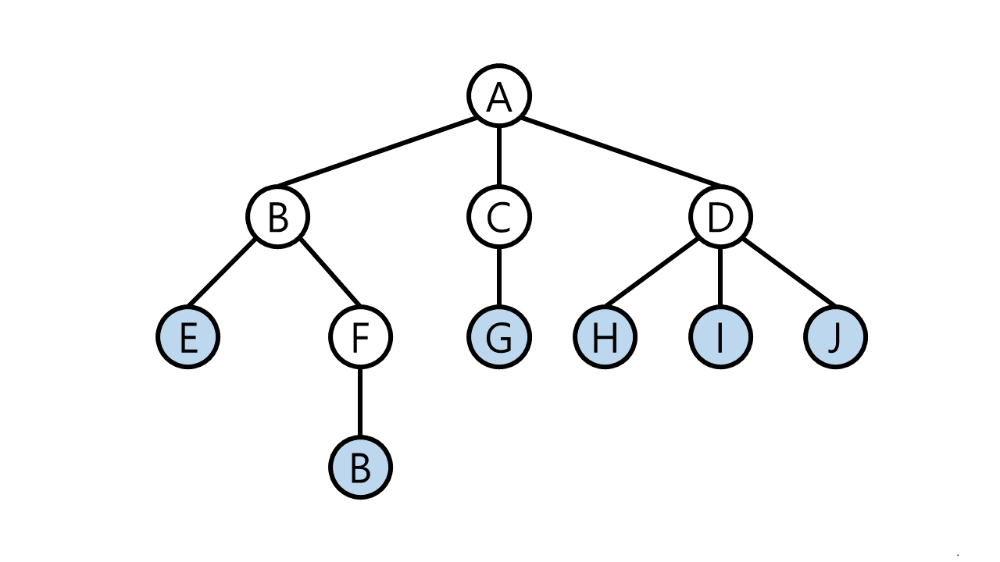
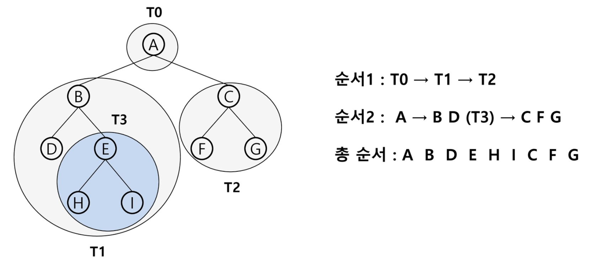
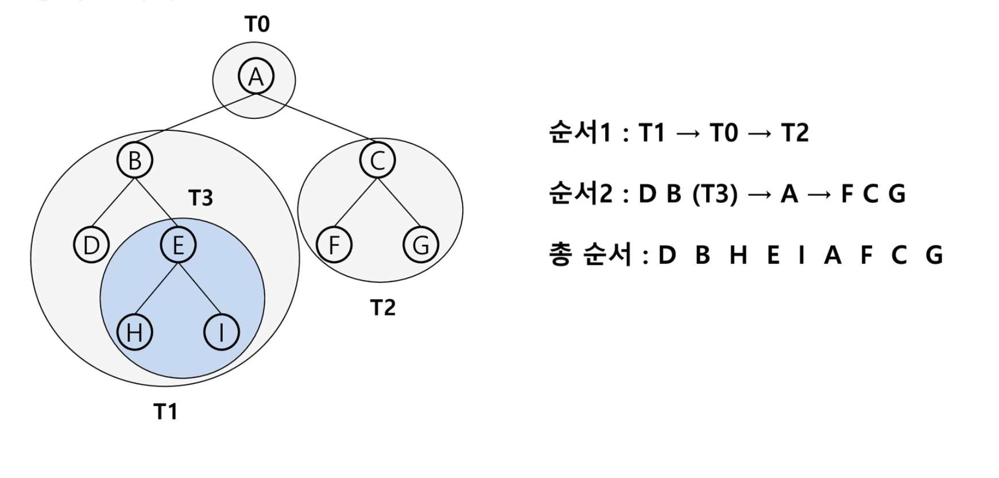
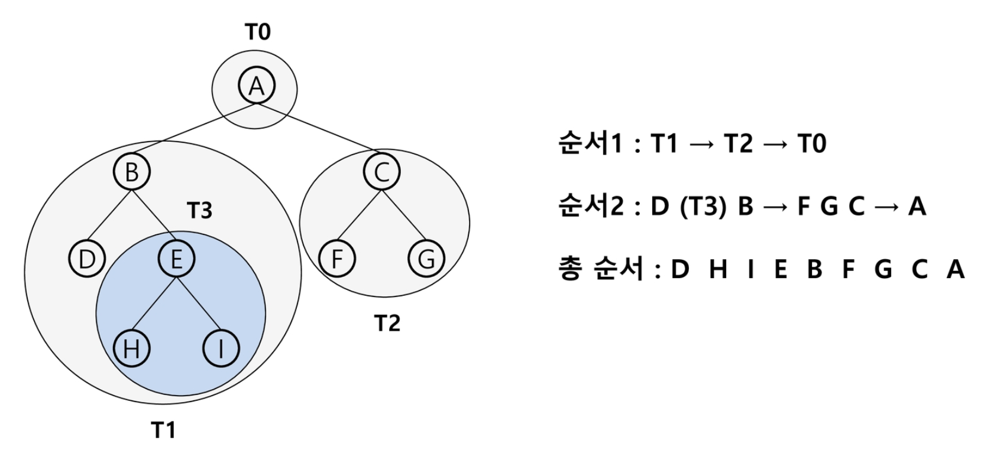
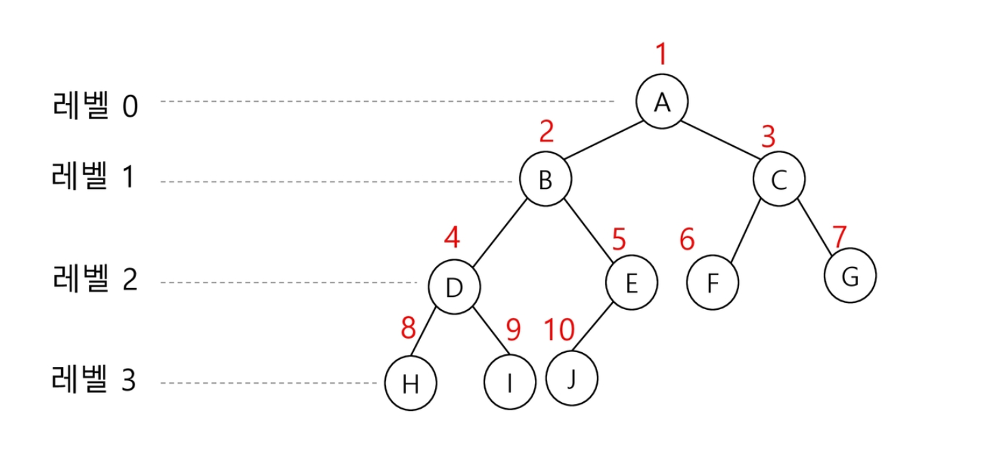

# Tree

[TOC]

## 트리의 정의 및 특징

트리는 노드로 이루어진 자료 구조이다.

- 트리는 싸이클이 없는 `무향 연결 그래프`이다.
  - 두 노드(or 정점) 사이에는 유일한 경로가 존재한다.
  - 모든 노드는 서로 연결되어 있다.
  - 각 노드는 최대 하나의 부모 노드가 존재할 수 있다.
  - 각 노드는 자식 노드가 없거나 하나 이상이 존재할 수 있다.
- 간선의 수 E는 노드의 수 V에서 1을 뺀 값과 같다.
  
- 트리는 `비선형 구조`의 특징을 갖는다.
  - 원소들 간에 `1:n 관계`를 가지는 자료구조.
  - 원소들 간에 `계층 관계`를 가지는 자료구조.

- 트리는 한 개 이상의 노드로 이루전 유한 집합이며 다음 조건을 만족한다.
  - 노드 중 부모가 없는 노드를 `루트(root)`라 한다.
  - 나머지 노드들은 n(n >= 0)개의 분리 집합 T1, … , Tn으로 분리될 수 있다.
  - 이들 T1, … , Tn은 각각 하나의 트리가 되며(재귀적 정의) 루트의 `서브 트리(subtree)`라 한다.

<br/>


## 트리 용어



- **노드(node)** : 트리의 원소이며, 정점(vertex)이라고도 한다.

  ```python
  트리 T의 노드 - A, B, C, D, E, F, G, H, I, J, 
  ```

- **간선(edge)** : 노드를 연결하는 선.

- **루트 노드(root node)** : 트리의 시작 노드.

  ```python
  트리 T의 루트 노드 - A
  ```

- **형제 노드(sibling node)** : 같은 부모 노드의 자식 노드들.

  ```python
  B, C, D는 형제 노드
  ```

- **조상 노드** : 간선을 따라 루트 노드까지 이르는 경로에 있는 모든 노드들.

  ```python
  K의 조상 노드 - F, B, A
  ```

- **서브트리(subtree)** : 부모 노드와 연결된 간선을 끊었을 때 생성되는 트리.

- **자손 노드** : 서브 트리에 있는 하위 레벨의 노드들.

  ```python
  B의 자손 노드 - E, F, K
  ```

- **차수(degree)**

  ```python
  노드의 차수 : 노드에 연결된 자식 노드의 수.
  # B의 차수 = 2, C의 차수 = 1
  
  트리의 차수 : 트리에 있는 노드의 차수 중에서 가장 큰 값.
  # 트리 T의 차수 = 3
  
  단말 노드(리프 노드) : 차수가 0인 노드. 즉, 자식 노드가 없는 노드.
  # 트리 T의 단말 노드 - E, G, H, I, J, K
  ```

- **높이**

  ```python
  노드의 높이 : 루트에서 노드에 이르는 간선의 수. 노드의 레벨
  # B의 높이 = 1, F의 높이 = 2
  
  트리의 높이 : 트리에 있는 노드의 높이 중에서 가장 큰 값. 최대 레벨
  # 트리 T의 높이 = 3
  ```

<br/>

## 이진 트리(Binary Tree)

모든 노드들이 최대 2개의 서브 트리를 갖는 특별한 형태의 트리
각 노드가 자식 노드를 최대한 2개까지만 가질 수 있는 트리

- 왼쪽 자식 노드(left child node)
- 오른쪽 자식 노드(right child node)


### 이진 트리의 예


### 이진 트리의 특성

- 레벨 i에서 가질 수 있는 노드의 최대 개수는 2<sup>i</sup>개.
- 높이가 h인 이진 트리가 가질 수 있는 노드의 최소 개수는 (h+1)개가 되며, 최대 개수는 (2<sup>h+1</sup> - 1)개가 된다. 

<br/>


## 이진 트리의 종류

### 포화 이진 트리 (Full Binary Tree)

- 모든 레벨에 노드가 포화 상태로 채워져 있는 이진 트리.
- 높이가 h일 때, 최대 노드 개수인 (2<sup>h+1</sup> - 1)개의 노드를 가진 이진트리.
- 루트를 1번으로 하여 2<sup>h+1</sup> - 1까지 정해진 위치에 대한 노드를 가진다.


### 완전 이진 트리 (Complete Binary Tree)

- 높이가 h이고 노드 수가 n개일 때(단, 2<sup>h</sup> <= n < 2<sup>h+1</sup>-1), 포화 이진 트리의 노드 번호 1번부터 n번까지 빈 자리가 없는 이진 트리


### 편향 이진 트리 (Skewed Binary Tree)

- 높이 h에 대한 최소 개수의 노드를 가지면서 한쪽 방향의 자식 노드만을 가진 이진 트리
  - 왼쪽 편향 이진 트리
  - 오른쪽 편향 이진 트리

<br/>


## 이진 트리 - 순회(traversal)

- 순회(traversal) : 트리의 각 노드를 중복되지 않게 전부 방문하는 것을 말한다. 트리는 비선형구조이기 때문에 선형구조에서와 같이 선후 연결 관계를 알 수 없다.
  - 이진 탐색 트리의 구현은 7. 이진 탐색 트리의 코드를 참조!


### 1. 깊이 우선 순회 (Depth First Traversal)

#### 전위 순회(preorder traversal) : VLR



- 자손 노드보다 현재 노드를 먼저 방문한다.

- 수행 방법

  ```python
  1. 현재 노드 n을 방문하여 처리한다. # V
  2. 현재 노드 n의 왼쪽 서브 트리를 순회한다. # L
  3. 현재 노드 n의 오른쪽 서브 트리를 순회한다. # R
  ```

- 전위 순회 알고리즘

  ```python
  class BinarySearchTree(object):
      ...
      def pro_order_traversal(self):
          def _pre_order_traversal(root):
              if root is None:
                  pass
              else:
                  print(root.data)
                  _pre_order_traversal(root.left)
                  _pre_order_traversal(root.right)
          _pre_order_traversal(self.root)
  ```


#### 중위 순회(inorder traversal) : LVR



- 왼쪽 자손 노드, 현재 노드, 오른쪽 자손 노드 순으로 방문한다.

- 수행 방법

  ```python
  1. 현재 노드 n의 왼쪽 서브 트리를 순회한다. # L
  2. 현재 노드 n을 방문하여 처리한다. # V
  3. 현재 노드 n의 오른쪽 서브 트리를 순회한다. # R
  ```

- 중위 순회 알고리즘

  ```python
  class BinarySearchTree(object):
      ...
      def in_order_traversal(self):
          def _in_order_traversal(root):
              if root is None:
                  pass
              else:
                  _in_order_traversal(root.left)
                  print(root.data)
                  _in_order_traversal(root.right)
          _in_order_traversal(self.root)
  ```


#### 후위 순회(postorder traversal) : LRV



- 현재 노드보다 자손 노드를 먼저 방문한다.

- 수행 방법

  ```python
  1. 현재 노드 n의 왼쪽 서브 트리를 순회한다. # L
  2. 현재 노드 n의 오른쪽 서브 트리를 순회한다. # R
  3. 현재 노드 n을 방문하여 처리한다. # V
  ```

- 후위 순회 알고리즘

  ```python
  class BinarySearchTree(object):
      ...
      def post_order_traversal(self):
          def _post_order_traversal(root):
              if root is None:
                  pass
              else:
                  _post_order_traversal(root.left)
                  _post_order_traversal(root.right)
                  print(root.data)
          _post_order_traversal(self.root)
  ```


### 2. 너비 우선 순회 (Breadth First Traversal)

#### 레벨 순회 (level-order traversal)

- 맨 위 루트 노드부터 깊이 순으로 방문한다.

- 레벨 순회 알고리즘

  ```python
  class BinarySearchTree(object):
      ...
      def level_order_traversal(self):
          def _level_order_traversal(root):
              queue = [root]
              while queue:
                  root = queue.pop(0)
                  if root is not None:
                      print(root.data)
                      if root.left:
                          queue.append(root.left)
                      if root.right:
                          queue.append(root.right)
          _level_order_traversal(self.root)
  ```

  


<br/>

## 트리의 표현

### 배열을 이용한 이진 트리의 표현



- 이진 트리에 각 노드 번호를 위와 같이 할당한다.
- 루트의 번호를 1로 부여하고, 레벨 n에 있는 노드에 대하여 왼쪽부터 오른쪽으로 2<sup>n</sup>부터 2<sup>n+1</sup>-1까지 번호를 차례로 부여한다.
- 노드 번호를 배열의 인덱스로 사용한다.
- 따라서 높이가 h인 이진 트리를 위해선 2<sup>h+1</sup>-1만큼의 크기를 가진 배열이 필요하다.


### 노드 번호의 성질

- 노드 번호가 i인 노드의 부모의 노드 번호 : i // 2
- 노드 번호가 i인 노드의 왼쪽 자식 노드 번호 : 2 * i
- 노드 번호가 i인 노드의 오른쪽 자식 노드 번호 : 2 * i + 1
- 레벨 n의 시작 노드 번호 : 2<sup>n</sup>


### 배열을 통한 이진 트리 표현의 단점

- 편향 이진 트리의 경우에 사용하지 않는 배열 원소에 대한 메모리 공간 낭비가 발생한다.
- 트리의 중간에 새로운 노드를 삽입하거나 기존의 노드를 삭제할 경우 배열의 크기를 변경하기 어려워 비효율적이다.
- 이를 보완하기 위해 링크드 리스트를 이용하여 트리를 표현할 수 있다.

<br/>


## 이진 탐색 트리

### 이진 탐색 트리의 특징

- 탐색 작업을 효율적으로 하기 위한 자료구조.
- 모든 원소는 서로 다른 유일한 키를 갖는다.
- key(왼쪽 서브 트리) < key(루트 노드) < key(오른쪽 서브 트리)
- 왼쪽 서브 트리와 오른쪽 서브 트리도 이진 탐색 트리다.
- 중위 순회하면 오름차순으로 정렬된 값을 얻을 수 있다.


### 이진 탐색 트리의 구현

1. 클래스 정의, 초기화

   - 이진 탐색 트리를 구현하기 위해 먼저 `Node` 클래스를 정의한다. `Node`클래스는 노드값(`self.data`)과 좌/우 노드(`self.left`, `self.right`), 총 세 개의 속성을 가진다. 초기화할 때는 데이터 값만 주어지고 좌우 노드가 비어있다.

   ```python
   class Node(object):
       def __init__(self, data):
           self.data = data
           self.left = self.right = None
        
   ```

2. 이진 탐색 트리 클래스인 `BinarySearchTree`를 구현한다.

   ```python
   class BinarySearchTree(object):
       def __init__(self):
           self.root = None
           
       # 삽입 메서드 구현
       def insert(self, data):
           self.root = self.insert_value(self.root, data)
           return self.root is not None
       
       def insert_value(self, node, data):
           if node is None:
               node = Node(data)
           else:
               if data <= node.data:
                   node.left = self.insert_value(node.left, data)
               else:
                   node.right = self.insert_value(node.right, data)
           return node
           
       # 탐색 메서드 구현
       def find(self, key):
           return self.find_value(self.root, key)
       
       def find_value(self, root, key):
           if root is None or root.data == key:
               return root is not None
           elif key < root.data:
               return self.find_value(root.left, key)
           else:
               return self.find_value(root.right, key)
           
       # 삭제 메서드 구현
       # 삭제할 노드의 자식이 두 개일 때는 오른쪽 서브트리에서 가장 왼쪽 아래에 위치한 자손을 가져오면 된다. 이 원소는 왼쪽 서브트리의 모든 원소들보다 크면서, 오른쪽 서브트리의 나머지 원소보다 작다.
       def delete(self, key):
           self.root, deleted = self.delete_value(self.root, key)
           return deleted
       
       def delete_value(self, node, key):
           if node is None:
               return node, False
           
           deleted = False
           if key == node.data:
               deleted = True
               if node.left and node.right:
                   parent, child = node, node.right
                   while chlid.left is not None:
                       parent, child = child, child.left
                   child.left = node.left
                   if parent != node:
                       parent.left = child.right
                       child.right = node.right
                   node = child
               elif node.left or node.right:
                   node = node.left or node.right
               else:
                   node = None
           elif key < node.data:
               node = node.left or node.right
           else:
               node = None
       elif key < node.data:
           node.left, deleted = self.delete_value(node.left, key)
       else:
           node.right, deleted = self.delete_value(node.right, key)
       return node, deleted
          
   ```


### 탐색 연산

- 루트에서 탐색 시작.

- 탐색할 키 값 x를 루트 노드의 키 값 k와 비교한다.

  ```python
  x == k : 탐색 성공.
  x < k : 루트 노드의 왼쪽 서브 트리에 대해 탐색 연산 수행.
  x > k : 루트 노드의 오른쪽 서브 트리에 대해 탐색 연산 수행.
  ```

- 서브 트리에 대해서 순환적으로 탐색 연산을 반복한다.

- 탐색을 수행할 서브 트리가 없으면 탐색에 실패하게 된다.


### 삽입 연산

1. 먼저 탐색 연산을 수행한다.
   - 삽입할 원소와 같은 원소가 트리에 존재하면 삽입할 수 없으므로, 같은 원소가 트리에 있는지 탐색하여 확인한다.
   - 탐색에서 탐색 실패가 결정되는 위치가 삽입 위치가 된다.
2. 탐색 실패한 위치에 원소를 삽입한다.


### 삭제 연산

1. 먼저 탐색 연산을 수행한다.
2. 노드를 삭제한다.
3. 삭제된 노드의 서브트리를 이동한다.


### 이진 탐색 트리의 성능

- 탐색, 삽입, 삭제 시간은 트리의 높이만큼 시간이 걸린다.

  O(h)

- 평균의 경우 O(logn) : 이진 트리가 균형적으로 생성되어 있는 경우.

- 최악의 경우 O(n) : 한 쪽으로 치우친 편향 이진 트리의 경우.

<br/>


## 그래프와 트리의 차이


