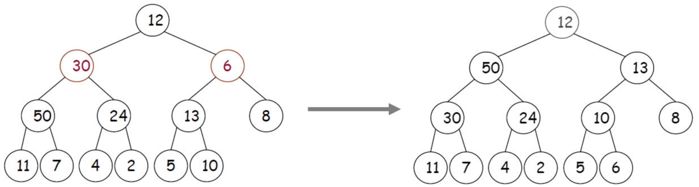
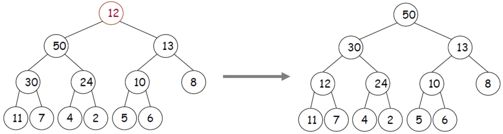

# Heap

[TOC]

## 힙의 정의

완전 이진 트리에 있는 노드 중에서 키 값이 가장 큰 노드나 키 값이 가장 작은 노드를 찾기 위해서 만들어진 자료구조.

- 완전 이진 트리의 일종으로 `우선순위 큐(Priority Queue)`를 위하여 만들어진 자료구조이다.

  - **우선순위 큐(Priority Queue)** : 우선순위의 개념을 큐에 도입한 자료구조. 데이터들이 우선순위를 갖고 있기 때문에 우선순위가 높은 데이터가 먼저 나간다.

  - 우선순위는 `배열 리스트`, `연결 리스트`, `힙`으로 구현이 가능하다. 이 중에 힙으로 구현하는 것이 가장 효율적이다.

    

    

- 여러 개의 값들 중에서 최댓값이나 최솟값을 빠르게 찾아내도록 만들어진 자료구조이다.

- 힙은 일종의 `반정렬 상태(느슨한 정렬 상태)` 를 유지한다.
  - 큰 값이 상위 레벨에 있고 작은 값이 하위 레벨에 있다는 정도
  - 간단히 말하면 부모 노드의 키 값이 자식 노드의 키 값보다 항상 큰(작은) 이진 트리를 말한다.
  
- 힙 트리에서는 중복된 값을 허용한다. (이진 탐색 트리에서는 중복된 값을 허용하지 않는다.)


### 힙의 종류

#### 최대 힙(max heap)

- 키 값이 가장 큰 노드를 찾기 위한 완전 이진 트리
- 부모 노드의 키 값 > 자식 노드의 키 값
- 루트 노드 : 키 값이 가장 큰 노드

#### 최소 힙(min heap)

- 키 값이 가장 작은 노드를 찾기 위한 완전 이진 트리
- 부모 노드의 키 값 < 자식 노드의 키 값
- 루트 노드 : 키 값이 가장 작은 노드


### 힙 vs 이진 탐색 트리

- 힙은 각 노드의 값이 자식노드보다 큰 반면, 이진탐색트리는 왼쪽 자식노드가 제일 작고 부모노드가 그 다음 크며 오른쪽 자식노드가 가장 큰 값을 가진다.
-  힙은 우선순위(키) 정렬에, 이진탐색트리는 탐색에 강점을 지닌 자료구조라고 볼 수 있다. 


## 힙(heap)의 구현

### 힙의 표현

힙은 완전이진트리(complete binary tree) 성질을 만족하기 때문에 다음처럼 1차원 배열(array)로도 표현이 가능하다.


- 힙을 저장하는 표준적인 자료구조는 배열이다.
- 구현을 쉽게 하기 위하여 배열의 첫 번째 인덱스인 0은 사용되지 않는다.
- 특정 위치의 노드 번호는 새로운 노드가 추가되어도 변하지 않는다.
  예를 들어 루트 노드의 오른쪽 노드의 번호는 항상 3이다.
- 힙에서의 부모 노드와 자식 노드의 관계
  - 왼쪽 자식의 인덱스 = (부모의 인덱스) * 2
  - 오른쪽 자식의 인덱스 = (부모의 인덱스) * 2 + 1
  - 부모의 인덱스 = (자식의 인덱스) / 2


### heapify

- 주어진 자료구조에서 힙 성질을 만족하도록 하는 연산


```python
def heapify(unsorted, index, heap_size):
    largest = index
    left_index = 2 * index + 1
    right_index = 2 * index + 2
    if left_index < heap_size and unsorted[left_index] > unsorted[largest]:
        largest = left_index
    if right_index < heap_size and unsorted[right_index] > unsorted[largest]:
        largest = right_index
    if largest != index:
        unsorted[largest], unsorted[index] = unsorted[index], unsorted[largest]
        heapify(unsorted, largest, heap_size)
```

- 시간복잡도 : **O(logn)**, 최악의 경우 루트 노드에서 단말 노드까지 값을 비교해야 하므로 트리의 높이에 의존적이다.


### 삽입

1. 힙에 새로운 요소가 들어오면, 일단 새로운 노드를 힙의 마지막 노드에 이어서 삽입한다.
2. 새로운 노드를 부모 노드들과 교환해서 힙의 성질을 만족시킨다.


```python
# 최대힙
def heappush(heap, item):
    heap.append(item)
    idx = len(heap)
    while idx != 1 and item > heap[idx//2]:
        heap[idx], heap[idx//2] = heap[idx//2], heap[idx]
        idx //= 2
    return heap
```


### 삭제

1. 최대 힙에서 최댓값은 루트 노드이므로 루트 노드가 삭제된다.
   - 최대 힙(max heap)에서 삭제 연산은 최댓값을 가진 요소를 삭제하는 것이다.
2. 삭제된 루트 노드에는 힙의 마지막 노드를 가져온다.
3. 힙을 재구성한다.


```python
def heappop(heap):
    pop_value = heap[1]
    heap[1] = heap.pop()
    heap_size = len(heap)
    parent = 1
    child = 2
    while child <= heap_size:
        if child < heap_size and (heap[child] < heap[child+1]):
            child += 1
        if heap[parent] >= heap[child]:
            break
        heap[parent], heap[child] = heap[child], heap[parent]
        parent = child
        child *= 2
    return pop_value
```


### build heap

 잎새노드를 가지지 않는 노드(=배열의 개수를 2로 나눈 몫을 인덱스로 하는 노드)부터 차례대로 *heapify*를 수행한다.. 하단 좌측그림에서 보는 것처럼 8, 13, 4, 7 순서대로 **위에서 아래로** *heapify*를 수행한니다. 






- 시간복잡도 : **O(n)**, 비어 있는 힙에 차례로 insert 연산을 수행해 힙을 만들어 가는 방식(**O(nlogn)**)보다 효율적이다.