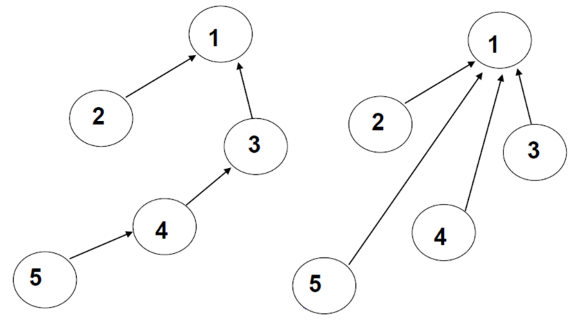

# Disjoint Set

[TOC]

## 디스조인트 셋(Disjoint Set, 서로소 집합)

 서로 중복되지 않는 부분 집합들로 나눠진 원소들에 대한 정보를 저장하고 조작하는 자료 구조. 디스조인트 셋은 전체 집합이 있을 때 구성 원소들이 겹치지 않도록 분할(partition)하는 데 자주 쓰인다.

- 집합을 구현하는 데는 비트 벡터, 배열, 연결 리스트를 이용할 수 있으나 그 중 가장 효율적인 트리 구조를 이용하여 구현한다.


### 디스조인트 셋의 용어

- 셋(set) : 개체들의 집합. 리스트 등과 달리 순서는 고려하지 않는다.
- 부분집합(subset) : 셋 A의 모든 원소가 셋 B에 포함될 때 A를 B의 `부분집합`이라 부른다.
- 초월집합(superset) : 셋 B가 셋 A의 모든 원소를 포함하고 있을 때 B를 A의 `초월집합`이라 한다.
-  mutually disjoint : 셋 A와 셋 B가 공유하는 원소가 하나도 없을 때.
- 분할(partition) : 다음의 조건을 만족하는 `디스조인트 셋`이 되도록 셋을 쪼갠다.
  - 분할된 부분집합을 합치면 원래의 셋이 된다.
  - 분할된 부분집합끼리는 mutually disjoint, 즉 겹치는 원소가 없다.


## 디스조인트 셋의 연산

### make-set(x)

- 초기화 작업
- x를 유일한 원소로 하는 새로운 집합을 만든다.


### find(x)

- x가 속한 셋의 대표값(루트 노드 값)을 반환한다. x가 어떤 집합에 속해 있는지 찾는 연산이다.
- 시간복잡도
  - 배열 : **O(1)**, 한 번만에 x가 속한 집합 번호를 찾는다.
  - 트리 : **O(L)**, 노드의 집합 번호는 루트 노드이므로, 루트 노드를 확인하여 같은 집합인지 확인한다. 트리의 높이와 시간 복잡도가 동일하다. (최악 : **O(N - 1)**)

```python
def find(x):
    # 루트 노드는 부모 노드 번호로 자기 자신을 가진다.
    if root[x] == x:
        return x
    else:
        return find(root[x])
```


### Union(x, y)

- x가 속한 셋과 y가 속한 셋을 합친다.
- 임의의 두 디스조인트 셋을 합칠 때는 원소수가 적은 셋을 많은 셋의 서브트리로 합치는 것이 효율적이다(*union-by-size*). 마찬가지로 트리의 높이가 작은 셋을 큰 셋의 서브트리로 합쳐야 한다(*union-by-height*). 다음 *union* 연산 때 반드시 *find* 연산을 수행해야 하는데 *find* 연산의 효율성을 높여주기 위해서다. 원소수와 트리의 높이는 비례하는 경향이 있고 *find* 연산의 계산복잡성은 이들에 매우 의존적이다.
- 시간복잡도
  - 배열 : **O(N)**, 배열의 모든 원소를 순회하면서 y의 집합 번호를 x의 집합 번호로 바꾼다.
  - 트리 : **O(1)**, *find* 연산에서 이미 두 디스조인트 셋의 루트노드를 찾았기 때문에 이 두 루트노드 위치에 저장돼 있는 원소수 혹은 높이를 비교해 작은 쪽의 루트노드에 해당하는 S의 값을 큰 쪽 루트노드의 인덱스를 가리키도록 바꾸기만 하면 된다. 이 모든 연산이 **O(1)**에 해당한다.

```python
def union(x, y):
    x = find(x)
    y = find(y)
    
    if x == y:
        return False
    
    if rank[x] < rank[y]:
        root[x] = y
    else:
        root[y] = x
        
        if rank[x] == rank[y]:
            rank[x] += 1
```


### 경로 압축(path compression)



- 모든 노드가 루트를 가리키도록 만드는 것. 트리나 배열에 부모 노드 인덱스 대신 루트 노드를 저장하는 방식이다.
- 트리의 높이만큼 거슬러 올라가야 루트를 찾을 수 있던 find 연산의 비효율성을 완화한다.

```python
def find(x):
    # 루트 노드는 부모 노드 번호로 자기 자신을 가진다.
    if root[x] == x:
        return x
    else:
        root[x] = find(root[x])
        return root[x]
```

