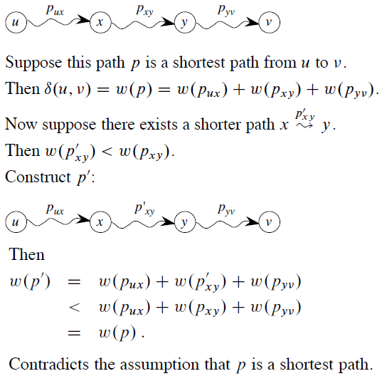
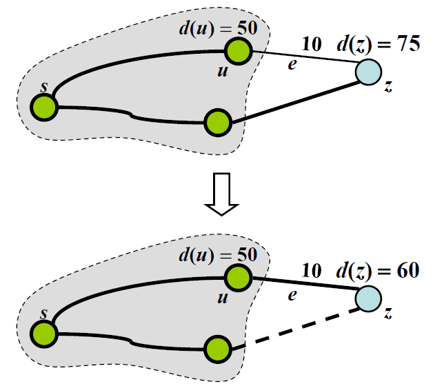
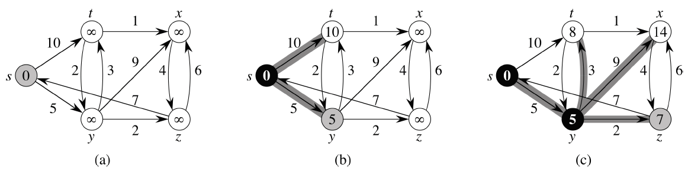
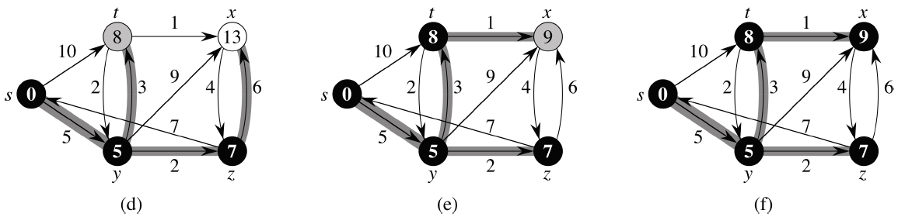
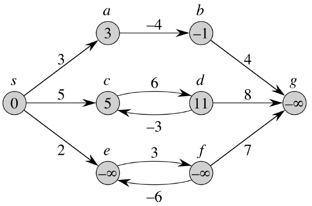
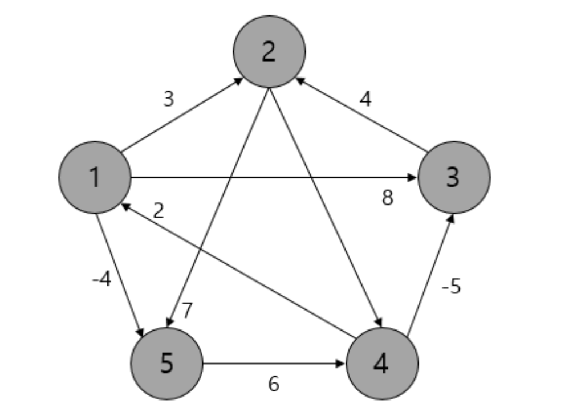

# Shortest Path

[TOC]

## 최단 경로 문제

두 노드를 잇는 가장 짧은 경로를 찾는 문제. 가중치 그래프에서는 간선 가중치의 합이 최소가 되도록 하는 경로를 찾는 것이 목표가 된다.


### 최단 경로 문제의 종류

- **단일 출발(single-source) 최단 경로** : 단일 노드 v에서 출발하여 그래프 내의 모든 다른 노드에 도착하는 가장 짧은 경로를 찾는 문제.
- **단일 도착(single-destination) 최단 경로** : 모든 노드들로부터 출발하여 그래프 내의 한 단일 노드 v로 도착하는 가장 짧은 경로를 찾는 문제. 그래프 내의 노드들을 거꾸로 뒤집으면 단일 출발 최단경로문제와 동일.
- **단일 쌍(single-pair) 최단 경로** : 주어진 꼭지점 u와 v에 대해 u에서 v까지의 최단 경로를 찾는 문제.
- **전체 쌍(all-pair) 최단 경로** : 그래프 내 모든 노드 쌍들 사이의 최단 경로를 찾는 문제.


## Optimal Substructure

**"최단 경로의 부분 경로 역시 최단 경로이다."**




위 정리를 확장하여 "시작 노드 s에서 v에 이르는 최단 경로는 s에서 u까지의 최단 경로에 u에서 v 사이의 가중치(거리)를 더한 값이다."라는 명제를 이끌어낼 수 있다.

```D(s, v) = D(s, u) + w(u, v)```

만약 위 식 우변의 값(현재 *step*에서 구한 새로운 경로의 거리)이 좌변보다 작다면 최단 경로를 업데이트 해준다. 이렇게 노드별로 하나씩 경로를 갱신하며 확장해 나가면 s에서 v 사이의 최단경로를 구할 수 있다.

- 이와 같이 어떤 문제의 최적해가 그 부분 문제들의 최적해들로 구성(*construct*)될 수 있다면 해당 문제는 *optimal substructure*를 가진다고 말한다.  


### edge relaxtion

최단 경로를 구하는 알고리즘은 `edge relaxtion(변 경감)`을 기본 연산으로 한다. 이는 최단 경로 문제의 `optimal substructure`에서 파생된 것이다.



위 예시는 시작노드 s에서 임의의 노드 z로의 최단경로를 구하는 문제이다.현재 시점에선 s와 z 사이의 최단 거리 d(z)가 75이고, s와 u 사이의 최단거리 d(u)는 50이라는 점을 알고 있다.

그런데 탐색 과정에서 간선 e를 경유하는 경로의 거리가 총 60이라고 한다면, 기존에 우리가 알고 있는 d(z)보다 짧아서 기존 d(z)가 최단경로라고 말할 수 없게 된다. 따라서 최단경로를 구성하고 있는 노드와 엣지 정보, 그리고 거리의 합을 업데이트해준다. 이러한 과정을 `edge relaxation`이라 한다.


## 다익스트라 알고리즘

`다익스트라 알고리즘`은 `단일 출발(single-source) 최단 경로`, 즉 단일 노드 v에서 출발하여 그래프 내의 모든 다른 노드에 도착하는 가장 짧은 경로를 찾는 문제를 해결하는 데 쓰이는 알고리즘이다.

- 첫 정점을 기준으로 연결되어 있는 정점들을 추가해 나가며 최단 거리를 갱신한다.
- `너비 우선 탐색(BFS)`을 기본으로 한다.
- `우선순위 큐(힙 구조)`를 사용하면 더욱 빠른 시간 내에 구현이 가능하다.
- 음의 가중치가 존재하는 그래프에 대해선 적용할 수 없다.


### 다익스트라 알고리즘의 구현





1. s에서 임의의 정점까지의 가중치 누적합이 저장될 리스트를 만들고, 그 값들을 무한대로 초기화한다.

   ```python
   from heapq import heappop, heappush
   
   INF = float('inf')
   cost = [INF] * (V + 1)
   queue = []
   ```

2. 시작 노드 s(1번 인덱스)를 기준으로 BFS를 실시한다. 다음 노드로 가는 간선의 가중치를 우선순위로 하여 힙에 삽입한다.

   ```python
   # (0, 0) : (1번 노드에서 1번 노드로 가는 가중치, 1번 노드)
   heappush(queue, (0, 1))
   dis[1] = 0
   while queue:
       cur_cost, now = heappop(queue)
       if cur_cost > cost[now]:
           continue
       for next_cost, next in adj[now]:
           temp = dis[now] + next_cost
           if temp < cost[next]:
               cost[nxt] = temp
               heappush(queue, (temp, next))
   ```

- 시간복잡도 : **O(ElogV)** - 우선순위 큐를 사용할 경우, **O(V<sup>2</sup>+E)** - 우선순위 큐를 사용하지 않을 경우


### 다익스트라 알고리즘에서 음의 가중치를 적용할 수 없는 이유

**이전 노드까지 계산해둔 최소거리 값이 최소라고 보장할 수 없기 때문**이다.

다익스트라는 정점을 지날수록 가중치가 증가한다 라는 사실을 전제하고 쓰여진 알고리즘이다. 하지만 음의 가중치가 있다면 정점을 지날수록 가중치가 감소할 수도 있다는 의미가 되므로 앞선 전제가 무너진다. 그러므로 다익스트라 알고리즘에서는 음의 가중치를 계산할 수 없다.


## 벨만-포드 알고리즘

`벨만-포드 알고리즘`은 시작 노드 s와 목표 노드 u 사이의 최단 경로를 구할 때 그래프 내 모든 간선에 대해 `edge relaxtion`을 수행한다. s와 u 사이의 최단 경로는 s, u뿐일 수도 있고, u를 제외한 그래프의 모든 노드(V - 1개) 가 s, u 사이에 최단 경로를 구성할 수도 있다. 따라서 벨만 포드 알고리즘은 모든 간선에 대한 `edge relaxtion`을 **V - 1회** 수행한다.

- `다익스트라 알고리즘`과 달리 음의 가중치가 존재하는 그래프에도 적용이 가능하다.

- 다음과 같이 음수 가중치가 사이클을 이루고 있는 경우(*e*, *f*)에는 작동하지 않는다.

  


### 벨만-포드 알고리즘의 구현

```python
def bellman_ford():
    INF = float('inf')
    cost = [INF] * (V + 1)
    cost[1] = 0

    for i in range(1, V + 1):
        # path = [(1, 2, 8), (1, 3, -2), ... , (4, 6, 5)]
        for start, end, weight in path:
            temp = cost[start] + weight
            if cost[end] > temp:
                cost[end] = temp

    for start, end, weight in path:
        if cost[end] <= cost[start] + weight:
            return False
        
    return True
```

- 시간복잡도 :  **O(VE)**, 그래프 모든 엣지에 대해 `edge relaxation`을 시작노드를 제외한 전체 노드수 만큼 반복 수행하고, 마지막으로 그래프 모든 엣지에 대해 `edge relaxation`을 1번 수행해 주기 때문이다.


## 플로이드-워셜 알고리즘

`플로이드-워셜 알고리즘`은 전체 쌍(all-pair) 최단 경로, 즉 그래프 내 모든 노드 쌍들 사이의 최단 경로를 찾는 문제에 적용할 수 있는 알고리즘이다.

- `다익스트라 알고리즘`과 달리 음의 가중치를 가진 간선이 계산 가능하다.
- 모든 정점에 대한 경로를 계산하므로 거리를 저장할 자료구조는 2차원 배열이 된다.
- `플로이드-워셜 알고리즘` 역시 `optimal substructure`의 개념을 이용하여 최단 경로를 탐색한다.
  - 정점 i와 j 사이의 모든 경유지를 탐색해서 그중 최단 경로를 찾아낸다.
  - dp\[i][j] = min(dp\[i][j], dp\[i][k] + dp\[k][j])


### 플로이드-워셜 알고리즘의 구현

- 플로이드 워셜에선 모든 경로에 대한 비용을 저장하는 테이블을 사용한다.

  

- 다음과 같은 그래프가 있을 때, 초기화되는 테이블 dp는 다음과 같다.

**비용을 저장한 테이블 dp**

|      |  1   |  2   |  3   |  4   |  5   |
| :--: | :--: | :--: | :--: | :--: | :--: |
|  1   |  0   |  3   |  8   | INF  |  -4  |
|  2   | INF  |  0   | INF  |  1   |  7   |
|  3   | INF  |  4   |  0   | INF  | INF  |
|  4   |  2   | INF  |  -5  |  0   | INF  |
|  5   | INF  | INF  | INF  |  6   |  0   |

```python
for k in range(V):
    for i in range(V):
        for j in range(V):
            if dp[i][k] != INF and dp[k][j] != INF:
                dp[i][j] = min(dp[i][j], dp[i][k] + dp[k][j])
```

- 시간복잡도 : **O(V<sup>3</sup>)**

