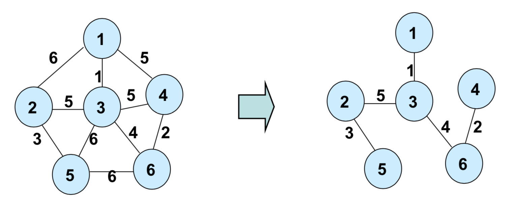

# Minimum Spanning Tree

[TOC]

## 신장 트리(Spanning Tree)

그래프 내의 모든 정점을 포함하는 트리

- `신장 트리(Spanning Tree)`는 그래프의 `최소 연결 부분 그래프`이다.
  - **최소 연결** : 간선의 수가 가장 적다.
  - *n*개의 정점을 가지는 그래프의 최소 간선 수는 *n - 1*개이고, *n - 1*개의 간선으로 연결되어 있으면 필연적으로 트리 형태가 된다.


### 신장 트리의 특징


- `DFS`, `BFS`를 이용하여 그래프에서 신장 트리를 찾을 수 있다.
  - 탐색 도중에 사용된 간선을 모아 만들 수 있다.
- 하나의 트리에는 많은 신장 트리가 존재할 수 있다.
- 원 그래프의 모든 노드를 포함해야 한다.
- 모든 노드가 서로 연결되어 있어야 한다.
- 트리의 속성을 포함해야 한다.
- `사이클`을 포함해선 안 된다. 
- 신장트리는 그래프에 있는 *n*개의 정점을 정확히 *n - 1*개로 연결한다.


## 최소 신장 트리(MST, Minimum Spanning Tree)

Spanning Tree 중에서 사용된 간선들의 가중치 합이 최소인 트리



### MST의 특징

- 간선 가중치의 합이 최소여야 한다.
- *n*개의 정점을 가지는 그래프에 대해 반드시 *n - 1*개의 간선만을 사용해야 한다.
- 사이클이 포함되어서는 안 된다.


## Kruskal 알고리즘

`탐욕적인 방법(greedy method)` 을 이용하여 네트워크(가중치를 간선에 할당한 그래프)의 모든 정점을 최소 비용으로 연결하는 최적 해답을 구하는 것

- 탐욕적인 방법

  ```python
  - 결정을 해야 할 때마다 그 순간에 가장 좋다고 생각되는 것을 선택함으로써 최종적인 해답에 도달하는 것.
  
  - 탐욕적인 방법은 그 순간에는 최적이지만, 전체적인 관점에서 최적이라는 보장이 없기 때문에 반드시 검증해야 한다.
  
  - 다행히 Kruskal 알고리즘은 최적의 해답을 주는 것으로 증명되어 있다.
  ```

- `MST(최소 비용 신장 트리)`가 **1) 최소 비용의 간선으로 구성됨** **2) 사이클을 포함하지 않음** 의 조건에 근거하여 각 단계에서 사이클을 이루지 않는 최소 비용 간선을 선택 한다.


### Kruskal 알고리즘의 원리

1. 그래프의 간선들을 가중치를 기준으로 오름차순 정렬한다.
2. 정렬된 간선 리스트에서 순서대로 사이클을 형성하지 않는 간선을 선택한다.
   - 가장 낮은 가중치를 지닌 간선부터 선택한다.
   - 사이클을 형성하는 간선을 제외한다.
3. 해당 간선을 현재의 `MST 집합`에 추가한다.
   - 이전 단계에서 만들어진 신장 트리와는 상관없이 무조건 최소 간선만을 선택하는 방법이다.


- **간선 선택**을 기반으로 하는 알고리즘
- 다음 간선을 이미 선택된 간선들의 집합에 추가할 때 사이클을 생성하는지 확인해야 한다.
  - 새로운 간선이 이미 다른 경로에 의해 연결되어 있는 정점들을 이을 때 사이클이 형성된다.
  - 즉, 추가할 새로운 간선의 양끝 정점이 같은 집합에 속해 있으면 사이클이 형성된다.
- 사이클 생성 여부를 확인하기 위해 `union-find 알고리즘`을 이용한다.


### Kruskal 알고리즘의 구현

```python
def find(x):
    if root[x] == x:
        return x
    # 경로 압축(path compression)을 통해 find 연산의 시간복잡도를 줄인다.
    root[x] = find(root[x])
    return root[x]


def union(x, y):
    x = find(x)
    y = find(y)
    
    # 만약 두 정점의 루트가 동일하다면, 이미 같은 집합에 속해 있는 것이기 때문에
    # False를 반환하고 union을 종료한다. 
    if x == y:
        return False
    
    if rank[x] < rank[y]:
        root[x] = y
    else:
        root[y] = x
        if rank[x] == rank[y]:
            rank[x] += 1
    return True


# 각 노드들의 루트가 저장될 리스트
root = [i for i in range(N + 1)]
# 인덱스를 루트로 하는 트리의 레벨이 기록될 리스트
rank = [0] * (N + 1)
res = 0

# 노드1, 노드2, 가중치 순으로 입력을 받았다면 2번 인덱스(가중치)를 기준으로 오름차순 정렬해준다.
edges = [list(map(int, input().split())) for _ in range(M)]
edges.sort(key=lambda x: x[2])
for n1, n2, w in edges:
    # 만약 union에 성공했다면(사이클을 형성하지 않았다면) 가중치 누적 합계를 갱신한다.
    if union(n1, n2):
        res += w

```

- 시간복잡도 : **O(ElogE)**, 데이터 수가 n개일 때 `find`연산과 `union` 연산의 시간복잡도는 **O(logn)**이다. 이를 전체 간선에 대해 반복 수행하므로, 반복문에서 필요한 계산량은 **O(ElogE)**가 된다.


## Prim 알고리즘

시작 정점에서부터 출발하여 신장트리 집합을 단계적으로 확장해 나가는 방법


### Prim 알고리즘의 원리

1. 시작 단계에서는 시작 정점만이 `MST 집합`에 포함된다.
2. 앞 단계에서 만들어진 집합에 인접한 정점들 중에서 최소 간선으로 연결된 정점을 선택하여 트리를 확장한다.
   - 즉, 가장 낮은 가중치를 가진 간선을 최우선으로 선택한다.
3. 2번 과정을 트리가 (N-1) 개의 간선을 가질 때까지 반복한다.


- **정점 선택**을 기반으로 하는 알고리즘
- 이전 단계에서 만들어진 신장 트리를 확장하는 방법으로 MST를 만들어 나간다.


### Prim 알고리즘의 구현

```python
from heapq import heappop, heappush


# 우선순위 큐와 다익스트라 알고리즘을 바탕으로 정점을 선택한다.
INF = float('inf')
def prim(start):
    # 처음엔 모든 정점의 비용을 무한대로 초기화 한다.
    cost = [INF] * (N + 1)
    vis = [False] * (N + 1)
    q = []
    # 시작 정점을 queue에 삽입하고 비용을 0으로 바꾼다.
    heappush(q, (0, start))
    cost[start] = 0
    while q:
        # 비용이 낮은 경로부터 탐색하며 정점을 선택한다.
        cur_cost, node = heappop(q)
        # 중복 선택을 막기 위해 경로를 확인한 정점은 방문 표시를 해준다.
        vis[node] = True
        for next, next_cost in adj[node]:
            # 1. 방문할 정점에 기록되어 있는 비용보다 새로 탐색할 경로의 비용이 작고
            # 2. 아직 방문하지 않은 정점일 경우에만
            # heappush를 실시한다.
            if cost[next] > next_cost and not vis[next]:
                cost[next] = next_cost
                heappush(q, (next_cost, child))
    return cost
```

- 시간복잡도
  - 우선순위 큐를 사용하지 않았을 경우 : **O(V<sup>2</sup>)**, 주 반복문이 정점의 수 V만큼 반복하고, 내부 반복문 역시 V번 반복되기 때문.
  - 우선순위 큐를 사용할 경우 : **O((V + E)logV)**