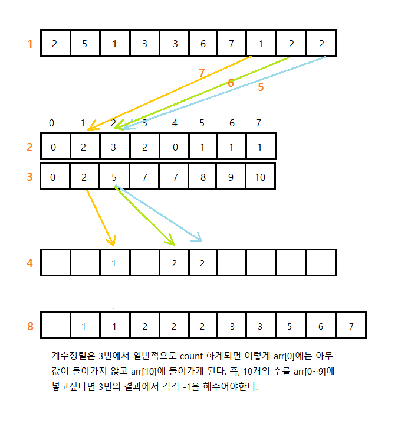

# Sort Algorithm

[TOC]

## 버블 정렬(Bubble Sort)

서로 인접한 두 원소를 검사하여 정렬하는 알고리즘. 인접한 두 원소를 비교하여 크기가 순서대로 되어 있지 않으면 서로 교환한다.


### 버블 정렬의 특징

- 장점
  - 구현이 매우 간단하다.
- 단점
  - 순서에 맞지 않은 요소를 인접한 요소와 교환한다.
  - 하나의 요소가 가장 왼쪽에서 가장 오른쪽으로 이동하기 위해서는 리스트에서 모든 다른 요소들과 교환되어야 한다.
  - 특히 특정 요소가 최종 정렬 위치에 이미 있는 경우라도 교환되는 일이 일어난다.
- 일반적으로 자료의 교환 작업(SWAP)이 자료의 이동 작업(MOVE)보다 더 복잡하기 때문에 버블 정렬은 단순성에도 불구하고 거의 쓰이지 않는다.
- 이미 정렬되어 있는 데이터에 적합한 기법이다.


### 버블 정렬의 구현

```python
def bubbleSort(array):
    for order in range(len(array), 0, -1):
        for i in range(order):
            if array[i] > array[i+1]:
                array[i], array[i+1] = array[i+1], array[i]
    return array

```

- 시간복잡도 : **O(N<sup>2</sup>)**
  - 비교 횟수
    - 최상, 평균, 최악 모두 일정
    - *n - 1, n - 2, … , 2, 1 번* = *n (n - 1) / 2*
  - 교환 횟수
    입력 자료가 역순으로 정렬되어 있는 최악의 경우, 한 번 교환하기 위하여 3번의 이동(SWAP 함수의 작업)이 필요하므로 (비교 횟수 * 3) 번 = *3n (n - 1) / 2*
    입력 자료가 이미 정렬되어 있는 최상의 경우, 자료의 이동이 발생하지 않는다.
  - *T(n)* = **O(N<sup>2</sup>)**


## 선택 정렬(Selection Sort)

리스트에서 가장 작은 값을 갖고 있는 인덱스를 찾은 뒤 리스트의 앞에서부터 그 값을 채워나가며 정렬하는 방식


### 선택 정렬의 특징

- 장점
  - 자료 이동 횟수가 미리 결정된다.
- 단점
  - 안정성을 만족하지 않는다.
  - 즉, 값이 같은 레코드가 있는 경우에 상대적인 위치가 변경될 수 있다.

- `제자리 정렬(in-place sorting) 알고리즘`의 하나
  - 입력 리스트(정렬되지 않은 값들) 이외에 다른 추가 메모리를 요구하지 않는 정렬 방법


### 선택 정렬의 원리

- 해당 순서에 원소를 넣을 위치는 이미 정해져 있고, 어떤 원소를 넣을지 선택하는 알고리즘
  - 첫 번째 순서에는 첫 번째 위치에 가장 최솟값을 넣는다.
  - 두 번째 순서에는 두 번째 위치에 남은 값 중에서의 최솟값을 넣는다.
  - 위 과정을 반복한다.
- 과정 설명
  - 주어진 배열 중에서 최솟값을 찾는다.
  - 그 값을 맨 앞에 위치한 값과 교체한다(패스(pass)).
  - 맨 처음 위치를 뺀 나머지 리스트를 같은 방법으로 교체한다.
  - 하나의 원소만 남을 때까지 위의 1~3 과정을 반복한다.


### 선택 정렬의 구현

```python
def selectionSort(array):
    for order in range(len(array)):
        min_idx = order
        for i in range(order, len(array)):
            if array[i] < array[min_idx]:
                min_idx = i
        array[min_idx], array[order] = array[order], array[min_idx]
    return array
```

- 시간복잡도 : **O(N<sup>2</sup>)**
  - 비교 횟수
    - 두 개의 for 루프의 실행 횟수
    - 외부 루프: *(n-1)*번
    - 내부 루프(최솟값 찾기): *n-1, n-2, … , 2, 1* 번
  - 교환 횟수
    - 외부 루프의 실행 횟수와 동일. 즉, 상수 시간 작업
    - 한 번 교환하기 위하여 3번의 이동(SWAP 함수의 작업)이 필요하므로 *3(n-1)*번
  - *T(n) = (n - 1) + (n - 2) + … + 2 + 1 = n (n - 1)/2 =* **O(N<sup>2</sup>)**


## 삽입 정렬(Insertion Sort)

자료 리스트의 모든 요소를 앞에서부터 차례대로 이미 정렬된 리스트 부분과 비교 하여, 자신의 위치를 찾아 삽입함으로써 정렬을 완성하는 알고리즘.

- 매 순서마다 해당 원소를 삽입할 수 있는 위치를 찾아 해당 위치에 넣는다.


### 삽입 정렬의 특징

- 장점

  - 안정적인 정렬 방법
  - 레코드의 수가 적을 경우 알고리즘 자체가 매우 간단하므로 다른 복잡한 정렬 방법보다 유리할 수 있다.
  - 대부분의 레코드가 이미 정렬되어 있는 경우에 매우 효율적일 수 있다.
  - 입력의 크기가 작을 경우 빠르게 정렬한다.
- 단점

  - 비교적 많은 레코드들의 이동을 포함한다.
- 레코드 수가 많고 레코드 크기가 클 경우에 적합하지 않다.


### 삽입 정렬의 원리

- 삽입 정렬은 두 번째 자료부터 시작하여 그 앞(왼쪽)의 자료들과 비교하여 삽입할 위치를 지정한 후 자료를 뒤로 옮기고 지정한 자리에 자료를 삽입하여 정렬하는 알고리즘이다.
- 즉, 두 번째 자료는 첫 번째 자료, 세 번째 자료는 두 번째와 첫 번째 자료, 네 번째 자료는 세 번째, 두 번째, 첫 번째 자료와 비교한 후 자료가 삽입될 위치를 찾는다. 자료가 삽입될 위치를 찾았다면 그 위치에 자료를 삽입하기 위해 자료를 한 칸씩 뒤로 이동시킨다.
- 처음 Key 값은 두 번째 자료부터 시작한다.


### 삽입 정렬의 구현

```python
def insertionSort(array):
    for i in range(1, len(array)):
        j = i - 1
        key = array[i]
        while array[j] > key and j >= 0:
            array[j+1] = array[j]
            j = j -1
        array[j+1] = key
    return array
```

- 시간복잡도 : **O(N)** - 최선의 경우, **O(N<sup>2</sup>)** - 최악의 경우
  - 최선의 경우
    - 비교 횟수
      이동 없이 1번의 비교만 이루어진다.
      외부 루프 : *(n-1)*번
    - *Best* *T(n)* = **O(n)**
  - 최악의 경우(입력 자료가 역순일 경우)
  - 비교 횟수
    외부 루프 안의 각 반복마다 i번의 비교 수행
    외부 루프 : *(n - 1) + (n - 2) + … + 2 + 1 = n (n - 1) / 2 =* **O(N<sup>2</sup>)** 
  - 교환 횟수
    외부 루프의 각 단계마다 (i+2)번의 이동 발생
    *n (n - 1) / 2 + 2(n - 1) = (n<sup>2</sup> + 3n - 4) / 2* = **O(N<sup>2</sup>)** 
  - *Worst T(n)* =**O(N<sup>2</sup>)** 


## 셸 정렬(Shell Sort)

정렬되지 않은 리스트를 정렬하는 데 많은 계산량이 드는 `삽입 정렬`을 개선한 기법이다.

`삽입 정렬`이 어느 정도 정렬된 리스트에 대해서는 대단히 빠르게 동작하는 것에 착안해 만들어졌다.

- `삽입 정렬`의 최대 문제점 : 요소들이 삽입될 때, 이웃한 위치로만 이동한다.
- 즉, 만약 삽입되어야 할 위치가 현재 위치에서 상당히 멀리 떨어진 곳이라면 많은 이동을 해야만 제자리로 갈 수 있다.
- `삽입 정렬`과 다르게 `셸 정렬`은 전체의 리스트를 한번에 정렬하지 않는다.


### 셸 정렬의 특징

- 장점
  - 연속적이지 않은 부분 리스트에서 자료의 교환이 일어나면 더 큰 거리를 이동한다. 따라서 교환되는 요소들이 삽입 정렬보다는 최종 위치에 있을 가능성이 높아진다.
  - 부분 리스트는 어느 정도 정렬이 된 상태이기 때문에 부분 리스트의 개수가 1이 되게 되면 셸 정렬은 기본적으로 삽입 정렬을 수행하는 것이지만 삽입 정렬보다 더욱 빠르게 수행된다.
  - 알고리즘이 간단하여 프로그램으로 쉽게 구현할 수 있다.


### 셸 정렬의 원리

- 정렬해야 할 리스트의 각 *k*번째 요소를 추출해서 부분 리스트를 만든다. 이때, k를 `간격(gap)` 이라고 한다.
  - 간격의 초깃값 : (정렬할 값의 수) / 2
  - 생성된 부분 리스트의 개수는 `gap`과 같다.
- 각 회전마다 간격 *k*를 절반으로 줄인다. 즉, 각 회전이 반복될 때마다 하나의 부분 리스트에 속한 값들의 개수는 증가한다.
  - 간격은 홀수로 하는 것이 좋다.
  - 간격을 절반으로 줄일 때 짝수가 나오면 +1을 해서 홀수로 만든다.
- 간격 *k*가 1이 될 때까지 반복한다.


### 셸 정렬의 구현

```python
def gapInsertionSort(x, start, gap):
    for target in range(start+gap, len(array), gap):
        val = array[target]
        i = target
        while i > start:
            if array[i-gap] > val:
                array[i] = array[i-gap]
            else:
                break
            i -= gap
        array[i] = val

        
def shellSort(array):
    gap = len(array) // 2
    while gap > 0:
        for start in range(gap):
            gapInsertionSort(array, start, gap)
        gap = gap // 2
    return array
```

- 시간복잡도 : **O(N<sup>1.5</sup>)** - 평균적인 경우, **O(N<sup>2</sup>)** - 최악의 경우


## 계수 정렬(Counting Sort)

 정렬되어 있지 않은 리스트를 정렬하기 위해 각각의 값이 몇 개 있는지 세는 작업을 하고, 선형 시간에 정렬하는 알고리즘




### 계수 정렬의 특징

- 장점
  - 선형 시간으로 다른 정렬 알고리즘보다 빠른 시간 내에 정렬을 완료한다.
- 단점
  - 리스트에 특이값이 존재할 경우 공간복잡도와 시간복잡도가 비약적으로 상승한다.


### 계수 정렬의 원리

- 정렬 되어 있지 않은 리스트를 받아들인다.

- 각 값마다 몇개가 있는지 새로운 리스트에 적는다.

  (즉, 아래 2번의 배열은 1이 2개, 2가 3개, 3이 2개, ... ,7이 1개)

- 2번 리스트를 누적합 하여 7번배열까지 더한다.

  (0 + 2 = 2, 2 + 3 = 5 , ..., 9 + 1 = 10)

- 3번 리스트를 이용하여 4번 배열에 각 번호에 맞게 값을 하나씩 주고, -1씩 해준다.


### 계수 정렬의 구현

```python
# A: input array
# k: maximum value of A
def counting_sort(A, k):
    
    # B: output array
    # init with -1
    B = [-1] * len(A)
    
    # C: counting array
    # init with zeros
    C = [0] * (k + 1)
    
    # count occurences
    for a in A:
        C[a] += 1
    
    # update C
    for i in range(k):
        C[i+1] += C[i]
    
    # update B
    for j in reversed(range(len(A))):
    	B[C[A[j]] - 1] = A[j]
    	C[A[j]] -= 1

    return B
```

- 시간복잡도 : **O(N+k)**
  - A의 빈도를 세는 시간 **O(N)**
  - B를 만드는 시간 **O(N)** (A의 요소값들을 역순으로 훑어야 하기 때문)
  - C를 만드는 시간 **O(N+k)**
  - 다시 숫자를 B에 채워넣는 데 드는 시간 **O(N)**


## 합병 정렬(Merge Sort)

하나의 리스트를 두 개의 균등한 크기로 분할하고 분할된 부분 리스트를 정렬한 다음, 두 개의 정렬된 부분 리스트를 합하여 전체가 정렬된 리스트가 되게 하는 방법


### 합병 정렬의 특징

- 장점
  - 안정적인 정렬 방법
    - 데이터의 분포에 영향을 덜 받는다. 즉, 입력 데이터가 무엇이든 간에 정렬되는 시간은 동일하다. (**O(Nlog₂N)**로 동일)
  - 만약 레코드를 `연결 리스트(Linked List)`로 구성하면, 링크 인덱스만 변경되므로 데이터의 이동은 무시할 수 있을 정도로 작아진다.
    - `제자리 정렬(in-place sorting)`로 구현할 수 있다.
  - 따라서 크기가 큰 레코드를 정렬할 경우에 연결 리스트를 사용한다면, 합병 정렬은 퀵 정렬을 포함한 다른 어떤 졍렬 방법보다 효율적이다.

- 단점
  - 만약 레코드를 `배열(Array)`로 구성하면, 임시 배열이 필요하다.
    - `제자리 정렬(in-place sorting)`이 아니다.
  - 레코드들의 크기가 큰 경우에는 이동 횟수가 많으므로 매우 큰 시간적 낭비를 초래한다.


### 합병 정렬의 원리

- 합병 정렬은 다음의 단계로 이루어진다.
  - **분할(Divide)** : 입력 배열을 같은 크기의 2개의 부분 배열로 분할한다.
  - **정복(Conquer)** : 부분 배열을 정렬한다. 부분 배열의 크기가 충분히 작지 않으면 순환 호출 을 이용하여 다시 분할 정복 방법을 적용한다.
  - **결합(Combine)** : 정렬된 부분 배열들을 하나의 배열에 합병한다.
- 2개의 정렬된 리스트를 합병(merge)하는 과정
  - 2개의 리스트의 값들을 처음부터 하나씩 비교하여 두 개의 리스트의 값 중에서 더 작은 값을 새로운 리스트(sorted)로 옮긴다.
  - 둘 중 하나가 끝날 때까지 이 과정을 되풀이한다.
  - 만약 둘 중 하나의 리스트가 먼저 끝나게 되면 나머지 리스트의 값들을 전부 새로운 리스트로 복사한다.
  - 새로운 리스트를 원래의 리스트로 옮긴다.


### 합병 정렬의 구현

```python
def m_sort(start, end):
    global N
    if start + 1 == end:
        return [arr[start]]
    mid = (start + end) // 2
    l = m_sort(start, mid)
    r = m_sort(mid, end)
    return merge(l, r)


def merge(left, right):
    i = 0
    j = 0
    sorted_list = []
    len_l = len(left)
    len_r = len(right)
    while i < len_l and j < len_r:
        if left[i] < right[j]:
            sorted_list.append(left[i])
            i += 1
        else:
            sorted_list.append(right[j])
            j += 1
    if i < len_l:
        sorted_list += left[i:]
    else:
        sorted_list += right[j:]
    
    return sorted_list
```

#### 시간복잡도 : **O(NlogN)**

- 분할 단계
  비교 연산과 이동 연산이 수행되지 않는다.

- 합병 단계

  - 비교 횟수
  - 순환 호출의 깊이 (합병 단계의 수)
      - 레코드의 개수 n이 2의 거듭제곱이라고 가정(n = 2<sup>k</sup>)했을 때, n=2<sup>3</sup>의 경우, 2<sup>3</sup> -> 2<sup>2</sup> -> 2<sup>1</sup> -> 2<sup>0</sup> 순으로 줄어들어 순환 호출의 깊이가 3임을 알 수 있다. 이것을 일반화하면 n=2<sup>k</sup>의 경우, k (k = log₂n)임을 알 수 있다.
    - *k = log₂n*
    - 각 합병 단계의 비교 연산
  
      - 크기 1인 부분 배열 2개를 합병하는 데는 최대 2번의 비교 연산이 필요하고, 부분 배열의 쌍이 4개이므로 24=8번의 비교 연산이 필요하다. 다음 단계에서는 크기 2인 부분 배열 2개를 합병하는 데 최대 4번의 비교 연산이 필요하고, 부분 배열의 쌍이 2개이므로 42=8번의 비교 연산이 필요하다. 마지막 단계에서는 크기 4인 부분 배열 2개를 합병하는 데는 최대 8번의 비교 연산이 필요하고, 부분 배열의 쌍이 1개이므로 8*1=8번의 비교 연산이 필요하다. 이것을 일반화하면 하나의 합병 단계에서는 최대 n번의 비교 연산을 수행함을 알 수 있다.
    - 순환 호출의 깊이 만큼의 합병 단계 * 각 합병 단계의 비교 연산 = *nlog₂n*
  
  - 이동 횟수
    
    - 순환 호출의 깊이 (합병 단계의 수)
      - *k = log₂n*
    
    - 각 합병 단계의 이동 연산
      - 임시 배열에 복사했다가 다시 가져와야 되므로 이동 연산은 총 부분 배열에 들어 있는 요소의 개수가 n인 경우, 레코드의 이동이 2n번 발생한다.
    
    - 순환 호출의 깊이 만큼의 합병 단계 * 각 합병 단계의 이동 연산 = *2nlog₂n*

- *T(N) = Nlog₂N(비교) + 2Nlog₂N(이동) = 3Nlog₂N* = **O(nlog₂n)**


## 퀵 정렬(Quick Sort)

하나의 리스트를 `피벗(pivot)`을 기준으로 두 개의 비균등한 크기로 분할하고 분할된 부분 리스트를 정렬한 다음, 두 개의 정렬된 부분 리스트를 합하여 전체가 정렬된 리스트가 되게 하는 방법

- `분할 정복 알고리즘`의 하나로, 평균적으로 매우 빠른 수행 속도를 자랑하는 정렬 방법

  - `합병 정렬`과 달리 `퀵 정렬`은 리스트를 **비균등**하게 분할한다.

  ```python
  # 분할 정복(divide and conquer) 방법
  문제를 작은 2개의 문제로 분리하고 각각을 해결한 다음, 결과를 모아서 원래의 문제를 해결하는 전략이다.
  분할 정복 방법은 대개 순환 호출을 이용하여 구현한다.
  ```


### 퀵 정렬의 특징

- 장점
  - 속도가 빠르다.
    - 시간 복잡도가 **O(NlogN)**를 가지는 다른 정렬 알고리즘과 비교했을 때도 가장 빠르다.
  - 추가 메모리 공간을 필요로 하지 않는다.
    퀵 정렬은 **O(logN)**만큼의 메모리를 필요로 한다.
- 단점
  - 정렬된 리스트에 대해서는 퀵 정렬의 불균형 분할에 의해 오히려 수행시간이 더 많이 걸린다.
- 퀵 정렬의 불균형 분할을 방지하기 위하여 피벗을 선택할 때 더욱 리스트를 균등하게 분할할 수 있는 데이터를 선택한다.
  EX) 리스트 내의 몇 개의 데이터 중에서 크기순으로 중간 값(medium)을 피벗으로 선택한다.


### 퀵 정렬의 원리

- 퀵 정렬은 다음의 단계들로 이루어진다.
  - **분할(Divide)** : 입력 배열을 피벗을 기준으로 비균등하게 2개의 부분 배열(피벗을 중심으로 왼쪽: 피벗보다 작은 요소들, 오른쪽: 피벗보다 큰 요소들)로 분할한다.
  - **정복(Conquer)** : 부분 배열을 정렬한다. 부분 배열의 크기가 충분히 작지 않으면 순환 호출 을 이용하여 다시 분할 정복 방법을 적용한다.
  - **결합(Combine)** : 정렬된 부분 배열들을 하나의 배열에 합병한다.
- 순환 호출이 한번 진행될 때마다 최소한 하나의 원소(피벗)는 최종적으로 위치가 정해지므로, 이 알고리즘은 반드시 끝난다는 것을 보장할 수 있다.


### 퀵 정렬의 구현

```python
def quickSort(l, r):
    if l < r:
        pivot = partition(l, r)
        quickSort(pivot+1, r)
        quickSort(l, pivot-1)
        
        
def partition(l, r):
    # pivot을 무작위로 정했을 때 가장 효율이 높다.
    pivot = arr[r]
    i = l - 1
    for j in range(l, r):
        if arr[j] <= pivot:
            i += 1
            arr[i], arr[j] = arr[j], arr[i]
    arr[i+1], arr[r] = arr[r], arr[i+1]
    return i + 1
```

#### 시간복잡도 : O(NlogN)

- 최선의 경우

  - 비교 횟수

    - 순환 호출의 깊이
      - 레코드의 개수 n이 2의 거듭제곱이라고 가정(n = 2<sup>k</sup>)했을 때, n=2<sup>3</sup>의 경우, 2<sup>3</sup> -> 2<sup>2</sup> -> 2<sup>1</sup> -> 2<sup>0</sup> 순으로 줄어들어 순환 호출의 깊이가 3임을 알 수 있다. 이것을 일반화하면 n=2<sup>k</sup>의 경우, k (k = log₂n)임을 알 수 있다.
      - *k = log₂n*

    - 각 순환 호출 단계의 비교 연산
      - 각 순환 호출에서는 전체 리스트의 대부분의 레코드를 비교해야 하므로 평균 n번 정도의 비교가 이루어진다.
      - 평균 n번

    - 순환 호출의 깊이 * 각 순환 호출 단계의 비교 연산 = nlog₂n

  - 이동 횟수
    - 비교 횟수보다 적으므로 무시할 수 있다.

  - 최선의 경우 T(n) = O(nlog₂n)

- 최악의 경우

  - 리스트가 계속 불균형하게 나누어지는 경우 (특히, 이미 정렬된 리스트에 대하여 퀵 정렬을 실행하는 경우)

  - 비교 횟수

    - 순환 호출의 깊이
      - 레코드의 개수 n이 2의 거듭제곱이라고 가정(n=2^k)했을 때, 순환 호출의 깊이는 n임을 알 수 있다.
      - n

    - 각 순환 호출 단계의 비교 연산
      - 각 순환 호출에서는 전체 리스트의 대부분의 레코드를 비교해야 하므로 평균 n번 정도의 비교가 이루어진다.
      - 평균 n번
    - 순환 호출의 깊이 * 각 순환 호출 단계의 비교 연산 = n<sup>2</sup>

  - 이동 횟수

    - 비교 횟수보다 적으므로 무시할 수 있다.

  - 최악의 경우 T(n) = O(n<sup>2</sup>)

- 평균

  - 평균 T(n) = O(nlog₂n)
  - 시간 복잡도가 O(nlog₂n)를 가지는 다른 정렬 알고리즘과 비교했을 때도 가장 빠르다.
  - 퀵 정렬이 불필요한 데이터의 이동을 줄이고 먼 거리의 데이터를 교환할 뿐만 아니라, 한 번 결정된 피벗들이 추후 연산에서 제외되는 특성 때문이다.


## 힙 정렬(Heap Sort)

최대 힙 트리나 최소 힙 트리를 구성해 정렬을 하는 방법

- 내림차순 정렬을 위해선 최대 힙을, 오름차순 정렬을 위해선 최소 힙을 만든다.


### 힙 정렬의 특징

- 장점
  - 시간 복잡도가 좋은편
  - 힙 정렬이 가장 유용한 경우는 전체 자료를 정렬하는 것이 아니라 가장 큰 값 몇개만 필요할 때 이다.


### 힙 정렬의 원리

- 정렬해야 할 n개의 요소들로 최대 힙(완전 이진 트리 형태)을 만든다.
  - 내림차순을 기준으로 정렬
- 그 다음으로 한 번에 하나씩 요소를 힙에서 꺼내서 배열의 뒤부터 저장하면 된다.
- 삭제되는 요소들(최댓값부터 삭제)은 값이 감소되는 순서로 정렬되게 된다.


### 힙 정렬의 구현

```python
def heap_sort(a):
    def heapify(a, size, i):
    	largest = i
    	L = 2 * i + 1
    	R = 2 * i + 2
    	if L < size and a[i] < a[L]: 
            largest = L
    	if R < size and a[largest] < a[R]:
            largest = R
    	if largest != i:
    		a[i], a[largest] = a[largest], a[i]
    		heapify(a, size, largest)
            
            
    size = len(a)
    for i in range(size, -1, -1):
        heapify(a, size, i)
    for i in range(size-1, 0, -1):
    	a[i], a[0] = a[0], a[i]
    	heapify(a, i, 0)
```

